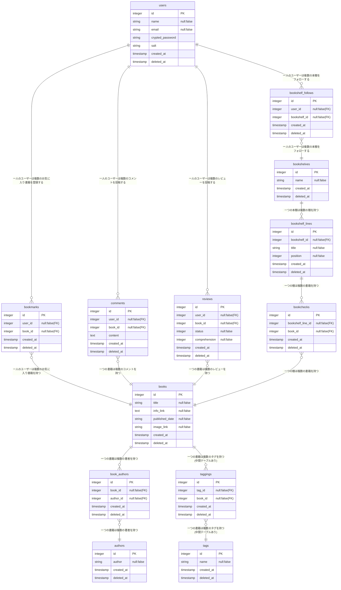

```mermaid
erDiagram

  users ||--o{ bookmarks :"一人のユーザーは複数のお気に入り書籍を登録する"
  bookmarks }o--|| books :"一人のユーザーは複数のお気に入り書籍を持つ"

  users ||--o{ comments :"一人のユーザーは複数のコメントを投稿する"
  comments }o--|| books :"一つの書籍は複数のコメントを持つ"

  users ||--o{ reviews :"一人のユーザーは複数のレビューを投稿する"
  reviews }o--|| books :"一つの書籍は複数のレビューを持つ"
  
  users ||--o{ bookshelf_follows :"一人のユーザーは複数の本棚をフォローする"
  bookshelf_follows }o--|| bookshelves :"一人のユーザーは複数の本棚をフォローする" 

  bookshelves ||--o{ bookshelf_lines : "一つの本棚は複数の棚を持つ"
  
  bookshelf_lines ||--o{ bookchecks :"一つの棚は複数の書籍を持つ"
  bookchecks }o--|| books :"一つの棚は複数の書籍を持つ"

  books ||--o{ book_authors :"一つの書籍は複数の著者を持つ"
  book_authors }o--|| authors :"一つの書籍は複数の著者を持つ"
  
  books ||--o{ taggings :"一つの書籍は複数のタグを持つ(中間テーブルあり)"
  taggings }o--|| tags :"一つの書籍は複数のタグを持つ(中間テーブルあり)"

  users {
    integer id "PK"
    string name "null:false"
    string email "null:false"
    string crypted_password
    string salt
    timestamp created_at
    timestamp deleted_at
  }

  bookshelf_follows {
    integer id "PK"
    integer user_id "null:false(FK)"
    integer bookshelf_id "null:false(FK)"
    timestamp created_at
    timestamp deleted_at
  }

  bookshelves {
    integer id "PK"
    string name "null:false"
    timestamp created_at
    timestamp deleted_at
  }

  bookshelf_lines {
    integer id "PK"
    integer bookshelf_id "null:false(FK)"
    string title "null:false"
    integer position "null:false"
    timestamp created_at
    timestamp deleted_at
  }

  bookchecks {
    integer id "PK"
    integer bookshelf_line_id "null:false(FK)"
    integer book_id "null:false(FK)"
    timestamp created_at
    timestamp deleted_at
  }

  books {
    integer id "PK"
    string title "null:false"
    text info_link "null:false"
    string published_date "null:false"
    string image_link "null:false"
    timestamp created_at
    timestamp deleted_at
  }

  book_authors {
    integer id "PK"
    integer book_id "null:false(FK)"
    integer author_id "null:false(FK)"
    timestamp created_at
    timestamp deleted_at
  }

  authors {
    integer id "PK"
    string author "null:false"
    timestamp created_at
    timestamp deleted_at
  }

  reviews {
    integer id "PK"
    integer user_id "null:false(FK)"
    integer book_id "null:false(FK)"
    integer status "null:false"
    integer comprehension "null:false"
    timestamp created_at
    timestamp deleted_at
  }

  bookmarks {
    integer id "PK"
    integer user_id "null:false(FK)"
    integer book_id "null:false(FK)"
    timestamp created_at
    timestamp deleted_at
  }

  taggings {
    integer id "PK"
    integer tag_id "null:false(FK)"
    integer book_id "null:false(FK)"
    timestamp created_at
    timestamp deleted_at
  }

  tags {
    integer id "PK"
    string name "null:false"
    timestamp created_at
    timestamp deleted_at
  }

  comments {
    integer id "PK"
    integer user_id "null:false(FK)"
    integer book_id "null:false(FK)"
    text content
    timestamp created_at
    timestamp deleted_at
  }

```