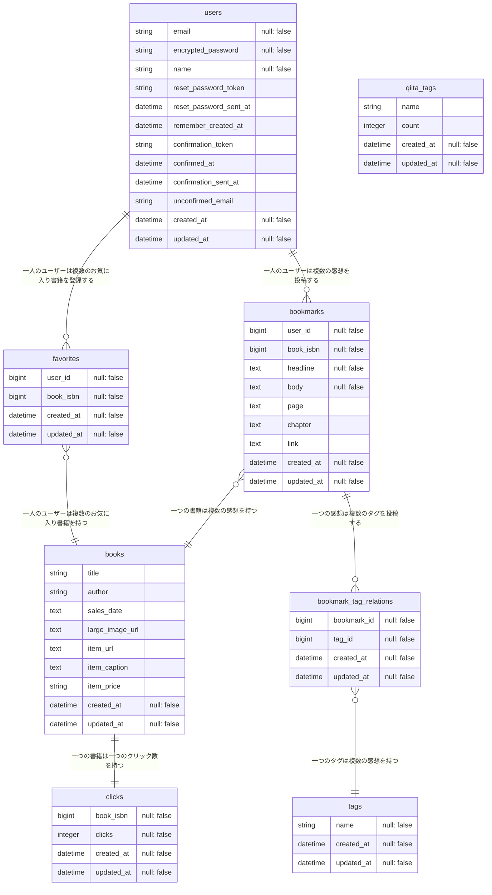

```mermaid

erDiagram
  users ||--o{ favorites :"一人のユーザーは複数のお気に入り書籍を登録する"
  favorites }o--|| books :"一人のユーザーは複数のお気に入り書籍を持つ"

  users ||--o{ bookmarks :"一人のユーザーは複数の感想を投稿する"
  bookmarks }o--|| books :"一つの書籍は複数の感想を持つ"

  bookmarks ||--o{ bookmark_tag_relations :"一つの感想は複数のタグを投稿する"
  bookmark_tag_relations }o--|| tags : "一つのタグは複数の感想を持つ"

  books ||--|| clicks: "一つの書籍は一つのクリック数を持つ"

  users {
    string email "null: false"
    string encrypted_password "null: false"
    string name "null: false"
    string reset_password_token
    datetime reset_password_sent_at
    datetime remember_created_at
    string confirmation_token
    datetime confirmed_at
    datetime confirmation_sent_at
    string unconfirmed_email
    datetime created_at "null: false"
    datetime updated_at "null: false"
  }

  bookmark_tag_relations {
    bigint bookmark_id "null: false"
    bigint tag_id "null: false"
    datetime created_at "null: false"
    datetime updated_at "null: false"
  }

  bookmarks {
    bigint user_id "null: false"
    bigint book_isbn "null: false"
    text headline "null: false"
    text body "null: false"
    text page
    text chapter
    text link
    datetime created_at "null: false"
    datetime updated_at "null: false"
  }

  books {
    string title
    string author
    text sales_date
    text large_image_url
    text item_url
    text item_caption
    string item_price
    datetime created_at "null: false"
    datetime updated_at "null: false"
  }

  clicks {
    bigint book_isbn "null: false"
    integer clicks "null: false"
    datetime created_at "null: false"
    datetime updated_at "null: false"
  }

  favorites {
    bigint user_id "null: false"
    bigint book_isbn "null: false"
    datetime created_at "null: false"
    datetime updated_at "null: false"
  }

  qiita_tags {
    string name
    integer count
    datetime created_at "null: false"
    datetime updated_at "null: false"
  }

  tags {
    string name "null: false"
    datetime created_at "null: false"
    datetime updated_at "null: false"
  }

```